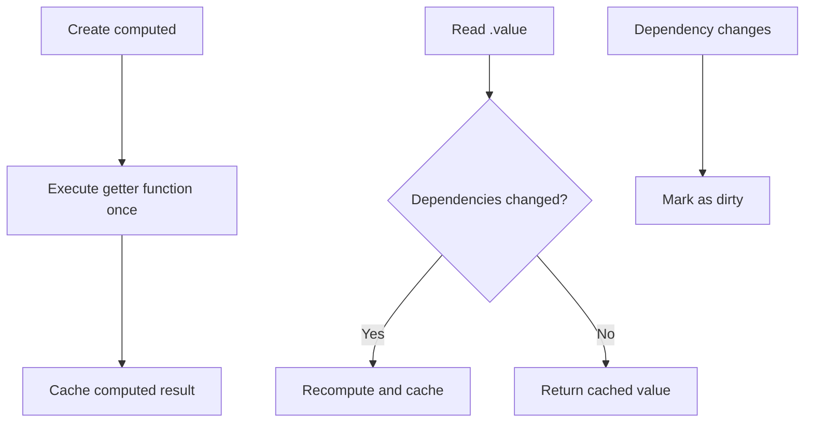

# computed

Creates a computed property whose value is derived from a function and automatically updates when its dependencies change.

## Basic Usage

```ts
import { computed, signal } from '@estjs/signals';

const count = signal(0);
const doubleCount = computed(() => count.value * 2);

console.log(doubleCount.value); // 0

count.value = 2;
console.log(doubleCount.value); // 4
```

## Type Definitions

```ts
// Read-only computed property (default)
function computed<T>(getter: () => T): Computed<T>;

// Writable computed property
function computed<T>(options: {
  get: () => T;
  set?: (value: T) => void;
}): Computed<T>;

// Computed property interface
interface Computed<T> {
  readonly value: T;
  peek(): T;
}
```

## Parameters

| Parameter | Type | Description |
|-----------|------|-------------|
| getter | `() => T` | Function used to compute the value |
| options | `Object` | Configuration object containing get and optional set methods |
| options.get | `() => T` | Function used to compute the value |
| options.set | `(value: T) => void` | Optional setter function to make the computed property writable |

## Return Value

Returns a `Computed<T>` object with the following properties and methods:

- **value** - Read-only property, accessing it automatically tracks dependencies
- **peek()** - Get the current computed value without establishing a dependency

## Examples

### Read-only Computed Property

```ts
import { computed, signal } from '@estjs/signals';

const firstName = signal('John');
const lastName = signal('Doe');

const fullName = computed(() => {
  return `${firstName.value} ${lastName.value}`;
});

console.log(fullName.value); // "John Doe"

firstName.value = 'Jane';
console.log(fullName.value); // "Jane Doe"
```

### Writable Computed Property

```ts
import { computed, signal } from '@estjs/signals';

const firstName = signal('John');
const lastName = signal('Doe');

const fullName = computed({
  get: () => `${firstName.value} ${lastName.value}`,
  set: newValue => {
    // Assuming newValue is "Jane Smith"
    const parts = newValue.split(' ');
    if (parts.length >= 2) {
      firstName.value = parts[0];
      lastName.value = parts.slice(1).join(' ');
    }
  },
});

console.log(fullName.value); // "John Doe"

fullName.value = 'Jane Smith'; // Will parse and update firstName and lastName
console.log(firstName.value); // "Jane"
console.log(lastName.value); // "Smith"
```

### Chained Computed Properties

Computed properties can depend on other computed properties:

```ts
const count = signal(0);
const doubled = computed(() => count.value * 2);
const quadrupled = computed(() => doubled.value * 2);

console.log(count.value); // 0
console.log(doubled.value); // 0
console.log(quadrupled.value); // 0

count.value = 2;
console.log(count.value); // 2
console.log(doubled.value); // 4
console.log(quadrupled.value); // 8
```

### Conditional Dependencies

Computed properties intelligently track branch dependencies:

```ts
const showDetails = signal(false);
const user = signal({ name: 'John', details: 'This is detailed information' });

const displayText = computed(() => {
  const base = `Name: ${user.value.name}`;
  if (showDetails.value) {
    return `${base}, Details: ${user.value.details}`;
  }
  return base;
});

// Only shows name
console.log(displayText.value); // "Name: John"

// Modifying details won't trigger recomputation because it's not in the current execution path
user.value = { ...user.value, details: 'Updated detailed information' };
console.log(displayText.value); // Still "Name: John"

// Show details
showDetails.value = true;
console.log(displayText.value); // "Name: John, Details: Updated detailed information"

// Now modifying details will trigger recomputation
user.value = { ...user.value, details: 'New detailed information' };
console.log(displayText.value); // "Name: John, Details: New detailed information"
```

## How It Works

Computed properties use lazy evaluation and caching mechanisms, only recomputing their value when:

1. The `.value` property is accessed for the first time
2. The `.value` property is accessed after dependencies have changed



## Type Checking

You can use the `isComputed` function to check if a value is a computed property:

```ts
import { computed, isComputed } from '@estjs/signals';

const double = computed(() => 2 * 2);
const notComputed = { value: 4 };

console.log(isComputed(double)); // true
console.log(isComputed(notComputed)); // false
```

## Performance Considerations

1. **Complex computations**: For computationally expensive operations, the caching mechanism of computed properties can significantly improve performance
2. **Avoid side effects**: Compute functions should be pure functions and should not execute side effects (like API calls)
3. **Minimize dependencies**: Only access signal values that are truly needed for the computation to avoid unnecessary recomputations

## Notes

1. **Synchronous execution**: Computed properties execute synchronously; don't use async operations in compute functions
2. **Avoid mutations**: Compute functions should be pure functions and should not modify other state
3. **Circular dependencies**: Avoid creating circular dependencies between computed properties, as this can lead to infinite loops

```ts
// Incorrect example: circular dependency
const a = computed(() => b.value + 1);
const b = computed(() => a.value + 1); // This will cause an infinite loop
```

4. **When to use peek()**: Use `peek()` when you need to use a computed value in another computed property or effect but don't want to establish a dependency relationship
