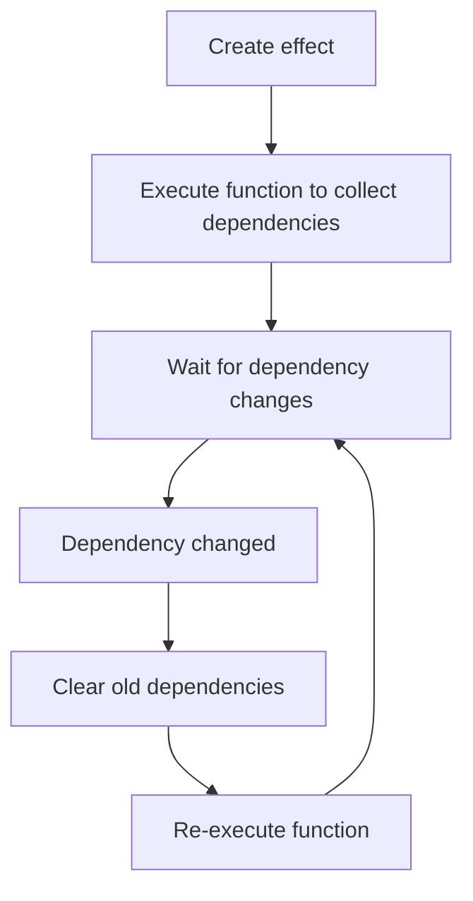

# effect

Creates an effect that automatically tracks dependencies and re-executes when reactive data it depends on changes.

## Basic Usage

```ts
import { effect, signal } from '@estjs/signals';

const count = signal(0);

// Create an effect that depends on count
const stop = effect(() => {
  console.log(`Current count: ${count.value}`);
});
// Output: Current count: 0

// Modifying the signal value automatically re-executes the effect
count.value = 1;
// Output: Current count: 1

// Stop the effect
stop();

// Modifications no longer trigger the effect
count.value = 2;
// No output
```

## Type Definitions

```ts
function effect(fn: () => void, options?: EffectOptions): () => void;

interface EffectOptions {
  // Controls when the effect executes
  // - 'sync': Synchronously (default)
  // - 'pre': Before component updates
  // - 'post': After component updates
  flush?: 'sync' | 'pre' | 'post';

  // Called when dependencies are tracked
  onTrack?: () => void;

  // Called when dependencies trigger updates
  onTrigger?: () => void;

  // Custom scheduler
  scheduler?: () => void;
}
```

## Parameters

| Parameter | Type | Description |
|-----------|------|-------------|
| fn | `() => void` | The effect function to execute |
| options | `EffectOptions` | Optional configuration options |

### options

| Option | Type | Default Value | Description |
|--------|------|---------------|-------------|
| flush | `'sync'｜'pre'｜'post'` | `'sync'` | Controls when the effect executes |
| onTrack | `() => void` | `undefined` | Callback called when dependencies are tracked |
| onTrigger | `() => void` | `undefined` | Callback called when dependencies trigger updates |
| scheduler | `() => void` | `undefined` | Custom scheduler function |

## Return Value

Returns a stop function that, when called, stops the effect from executing, even if dependencies change.

## Examples

### Basic Dependency Tracking

```ts
import { effect, signal } from '@estjs/signals';

const count = signal(0);
const name = signal('John');

effect(() => {
  console.log(`Name: ${name.value}, Count: ${count.value}`);
});
// Output: Name: John, Count: 0

// Only modifying name, only name's dependency is updated
name.value = 'Jane';
// Output: Name: Jane, Count: 0

// Only modifying count, only count's dependency is updated
count.value = 1;
// Output: Name: Jane, Count: 1
```

### Conditional Dependency Tracking

```ts
import { effect, signal } from '@estjs/signals';

const showCount = signal(true);
const count = signal(0);

effect(() => {
  if (showCount.value) {
    console.log(`Count: ${count.value}`);
  } else {
    console.log('Count is hidden');
  }
});
// Output: Count: 0

// When showCount is true, modifying count triggers the effect
count.value = 1;
// Output: Count: 1

// Hide the count
showCount.value = false;
// Output: Count is hidden

// Now modifying count doesn't trigger the effect because it's no longer a dependency
count.value = 2;
// No output
```

### Using Different Flush Options

```ts
import { effect, signal } from '@estjs/signals';

const count = signal(0);

// Synchronous execution (default behavior)
effect(() => {
  console.log(`Sync effect: ${count.value}`);
});

// Execute before component updates
effect(
  () => {
    console.log(`Pre-update effect: ${count.value}`);
  },
  { flush: 'pre' },
);

// Execute after component updates
effect(
  () => {
    console.log(`Post-update effect: ${count.value}`);
  },
  { flush: 'post' },
);

// Modify the signal value
count.value = 1;
```

### Cleanup in Effects

In some cases, you may need to perform cleanup operations before the effect runs again (e.g., unsubscribing or clearing timers). You can return a cleanup function from the effect:

```ts
import { effect, signal } from '@estjs/signals';

const id = signal(1);

effect(() => {
  const currentId = id.value;
  // Simulate async data fetching
  const controller = new AbortController();
  fetch(`https://api.example.com/data/${currentId}`, {
    signal: controller.signal,
  })
    .then(response => response.json())
    .then(data => console.log(data));

  // Return cleanup function
  return () => {
    controller.abort(); // Cancel ongoing request
  };
});

// When id changes, the previous request is cancelled
id.value = 2;
```

## untrack

The `untrack` function allows you to access reactive data inside an effect without establishing a dependency relationship:

```ts
import { effect, signal, untrack } from '@estjs/signals';

const count = signal(0);
const name = signal('John');

effect(() => {
  // This establishes a dependency relationship
  console.log(`Count: ${count.value}`);

  // This doesn't establish a dependency relationship; changes to name won't trigger this effect
  untrack(() => {
    console.log(`Untracked name: ${name.value}`);
  });
});

// Only triggers the effect once
count.value = 1;
// Output: Count: 1
// Output: Untracked name: John

// Doesn't trigger the effect
name.value = 'Jane';
// No output
```

### untrack Type Definition

```ts
function untrack<T>(fn: () => T): T;
```

## How It Works

The `effect` function works through the following steps:

1. Execute the provided function initially to collect dependencies
2. Re-execute the function when dependencies change
3. Before each re-execution, clear old dependencies and rebuild new dependency relationships



## Performance Considerations

1. **Minimize operations in effects**: Effect functions should be lean and avoid expensive computations
2. **Use computed properties**: For complex calculations, use computed properties instead of calculating directly in effects
3. **Be mindful of dependency collection**: Only access reactive data that is truly needed in the function

## Notes

1. **Avoid modifying dependencies in effects**: This can lead to infinite loops
```ts
// Incorrect example: infinite loop
effect(() => {
  count.value++; // Modifies a dependency, causing the effect to trigger indefinitely
});
```

2. **Effects should be synchronous**: Don't use async operations in effect functions
3. **Stop effects when no longer needed**: Call the returned stop function to prevent memory leaks
