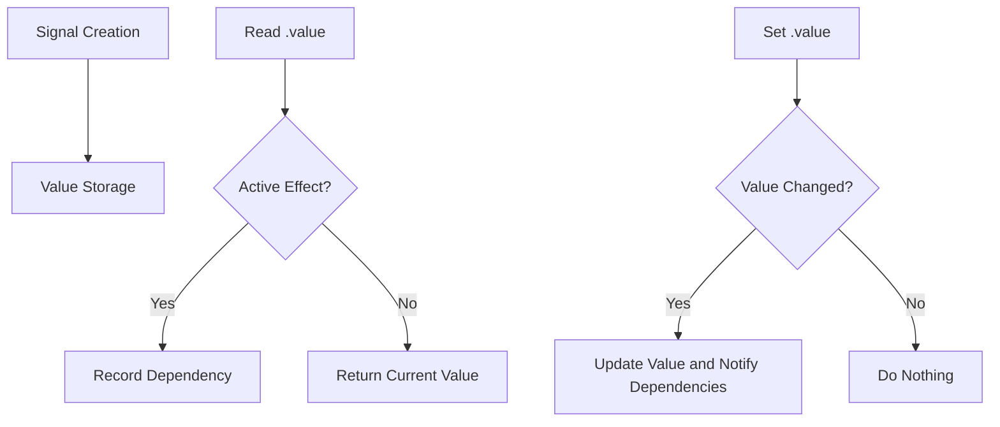

# signal

Creates a reactive signal to store and track changes in a value.

## Basic Usage

```ts
import { signal } from '@estjs/signals';

// Create a signal
const count = signal(0);

// Read the value of the signal
console.log(count.value); // 0

// Modify the value of the signal
count.value = 1;

// Use the update method to modify the signal's value
count.update(value => value + 1);

// Read the value without establishing a dependency
const currentValue = count.peek();
```

## Type Definitions

```ts
function signal<T>(value: T): Signal<T>;

interface Signal<T> {
  value: T;
  peek(): T;
  set(value: T): void;
  update(updater: (prev: T) => T): void;
}
```

## Parameters

| Parameter | Type | Description |
|-----------|------|-------------|
| value | `T` | The initial value of the signal, can be of any type |

## Return Value

Returns a `Signal<T>` object with the following properties and methods:

- **value** - Read or set the signal's value. Reading establishes a dependency, setting notifies dependents of updates.
- **peek()** - Read the current value without establishing a dependency.
- **set(value)** - Set the signal's value, equivalent to `signal.value = value`.
- **update(updater)** - Update the signal's value using a function that receives the current value and returns a new value.

## Examples

### Basic Operations

```ts
import { signal } from '@estjs/signals';

const count = signal(0);
console.log(count.value); // 0

count.value = 1;
console.log(count.value); // 1

count.update(val => val + 1);
console.log(count.value); // 2
```

### Different Data Types

```ts
// Number
const count = signal(0);

// String
const name = signal('John');

// Boolean
const isActive = signal(true);

// Object
const user = signal({ name: 'Alice', age: 30 });

// Array
const items = signal([1, 2, 3]);

// Null
const nullable = signal(null);
const undef = signal(undefined);
```

### Using with Other APIs

```ts
import { computed, effect, signal } from '@estjs/signals';

const count = signal(0);

// Create a computed property that depends on the signal
const doubleCount = computed(() => count.value * 2);

// Create an effect that observes signal changes
effect(() => {
  console.log(`Count: ${count.value}, Double: ${doubleCount.value}`);
});

// Modifying the signal value triggers the effect and updates the computed property
count.value = 1;
// Output: Count: 1, Double: 2
```

### Nested Objects

When a signal contains nested objects, changes to the internal object properties are tracked:

```ts
const user = signal({
  name: 'John',
  profile: {
    age: 30,
    address: {
      city: 'New York',
    },
  },
});

effect(() => {
  console.log(`User city: ${user.value.profile.address.city}`);
});

// Will trigger the effect
user.value.profile.address.city = 'San Francisco';
```

## Shallow Signal

For complex nested objects, if you only need to track changes to top-level properties, you can use `shallowSignal`:

```ts
import { shallowSignal } from '@estjs/signals';

const user = shallowSignal({
  name: 'John',
  profile: {
    age: 30,
  },
});

effect(() => {
  console.log(`User name: ${user.value.name}`);
});

// Will trigger the effect
user.value.name = 'Alice';

// Will NOT trigger the effect
user.value.profile.age = 31;
```

## How It Works

When a signal's `.value` is accessed, the currently active effect (if any) is recorded as a dependency of that signal. When the signal's value changes, all recorded dependencies are notified and re-executed.



## Type Checking

You can use the `isSignal` function to check if a value is a signal:

```ts
import { isSignal, signal } from '@estjs/signals';

const count = signal(0);
const notSignal = { value: 0 };

console.log(isSignal(count)); // true
console.log(isSignal(notSignal)); // false
```

## Considerations

1. **Avoid storing large immutable data structures in signals**: This can lead to frequent re-renders and memory consumption.
2. **Use peek() to avoid unnecessary dependencies**: When you only want to read a value without establishing a dependency relationship.
3. **Signals are deeply reactive for objects and arrays**: Since they use `reactive` under the hood, you can mutate objects directly inside signals, and it will automatically trigger dependency updates.

```ts
const user = signal({ name: 'John' });

// Modifying nested properties directly will correctly trigger dependency updates
user.value.name = 'Alice'; 
```

4. **Signals use a synchronous execution model**: When values change, related effects are immediately executed synchronously.
