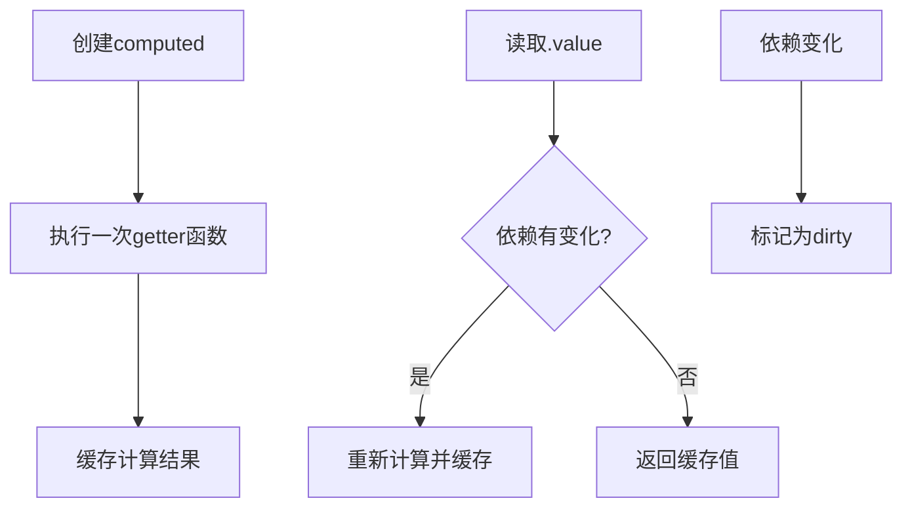

# computed

创建一个计算属性，它的值由一个函数派生，并且在依赖项变化时自动更新。

## 基本用法

```ts
import { computed, signal } from '@estjs/signals';

const count = signal(0);
const doubleCount = computed(() => count.value * 2);

console.log(doubleCount.value); // 0

count.value = 2;
console.log(doubleCount.value); // 4
```

## 类型定义

```ts
// 只读计算属性（默认）
function computed<T>(getter: () => T): Computed<T>;

// 可写计算属性
function computed<T>(options: {
  get: () => T;
  set?: (value: T) => void;
}): Computed<T>;

// 计算属性接口
interface Computed<T> {
  readonly value: T;
  peek(): T;
}
```

## 参数

| 参数 | 类型 | 描述 |
|------|------|------|
| getter | `() => T` | 用于计算值的函数 |
| options | `Object` | 配置对象，包含get和可选的set方法 |
| options.get | `() => T` | 用于计算值的函数 |
| options.set | `(value: T) => void` | 可选的设置函数，使计算属性可写 |

## 返回值

返回一个`Computed<T>`对象，具有以下属性和方法：

- **value** - 只读属性，访问时会自动追踪依赖关系
- **peek()** - 获取当前计算值而不建立依赖关系

## 示例

### 只读计算属性

```ts
import { computed, signal } from '@estjs/signals';

const firstName = signal('张');
const lastName = signal('三');

const fullName = computed(() => {
  return `${firstName.value}${lastName.value}`;
});

console.log(fullName.value); // "张三"

firstName.value = '李';
console.log(fullName.value); // "李三"
```

### 可写计算属性

```ts
import { computed, signal } from '@estjs/signals';

const firstName = signal('张');
const lastName = signal('三');

const fullName = computed({
  get: () => `${firstName.value}${lastName.value}`,
  set: newValue => {
    // 假设新值为"李四"
    const parts = newValue.split('');
    if (parts.length >= 2) {
      firstName.value = parts[0];
      lastName.value = parts.slice(1).join('');
    }
  },
});

console.log(fullName.value); // "张三"

fullName.value = '李四'; // 将分解并更新firstName和lastName
console.log(firstName.value); // "李"
console.log(lastName.value); // "四"
```

### 链式计算属性

计算属性可以依赖于其他计算属性：

```ts
const count = signal(0);
const doubled = computed(() => count.value * 2);
const quadrupled = computed(() => doubled.value * 2);

console.log(count.value); // 0
console.log(doubled.value); // 0
console.log(quadrupled.value); // 0

count.value = 2;
console.log(count.value); // 2
console.log(doubled.value); // 4
console.log(quadrupled.value); // 8
```

### 条件依赖

计算属性会智能地跟踪分支依赖：

```ts
const showDetails = signal(false);
const user = signal({ name: '张三', details: '这是详细信息' });

const displayText = computed(() => {
  const base = `姓名: ${user.value.name}`;
  if (showDetails.value) {
    return `${base}, 详情: ${user.value.details}`;
  }
  return base;
});

// 只显示姓名
console.log(displayText.value); // "姓名: 张三"

// 修改details不会触发重新计算，因为它不在当前执行路径中
user.value = { ...user.value, details: '更新的详细信息' };
console.log(displayText.value); // 仍然是 "姓名: 张三"

// 显示详情
showDetails.value = true;
console.log(displayText.value); // "姓名: 张三, 详情: 更新的详细信息"

// 现在修改details会触发重新计算
user.value = { ...user.value, details: '新的详细信息' };
console.log(displayText.value); // "姓名: 张三, 详情: 新的详细信息"
```

## 工作原理

计算属性使用懒惰求值和缓存机制，仅在以下情况重新计算值：

1. 首次访问计算属性的`.value`
2. 依赖项变化后首次访问`.value`



## 类型检查

您可以使用`isComputed`函数检查一个值是否为计算属性：

```ts
import { computed, isComputed } from '@estjs/signals';

const double = computed(() => 2 * 2);
const notComputed = { value: 4 };

console.log(isComputed(double)); // true
console.log(isComputed(notComputed)); // false
```

## 性能考虑

1. **复杂计算**：对于计算量大的操作，计算属性的缓存机制可以显著提高性能
2. **避免副作用**：计算函数应是纯函数，不应执行副作用（如API调用）
3. **依赖最小化**：只访问计算真正需要的信号值，以避免不必要的重新计算

## 注意事项

1. **同步执行**：计算属性的执行是同步的，不要在计算函数中使用异步操作
2. **避免突变**：计算函数应该是纯函数，不应修改其他状态
3. **循环依赖**：避免在计算属性之间创建循环依赖关系，这可能导致无限循环

```ts
// 错误示例：循环依赖
const a = computed(() => b.value + 1);
const b = computed(() => a.value + 1); // 这将导致无限循环
```

4. **peek()的使用时机**：当您需要在另一个计算属性或副作用中使用计算值，但不想建立依赖关系时，使用`peek()`
