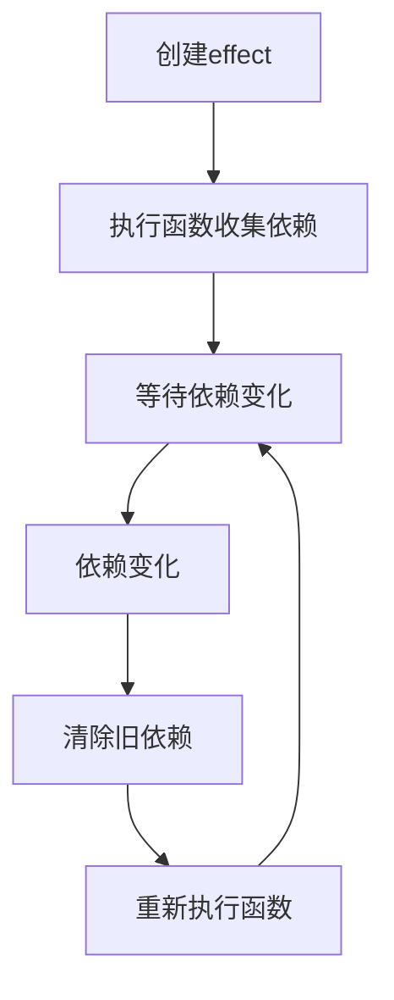

# effect

创建一个自动追踪依赖的副作用函数，这个函数会在其依赖的响应式数据变化时自动重新执行。

## 基本用法

```ts
import { effect, signal } from '@estjs/signals';

const count = signal(0);

// 创建一个依赖于count的副作用
const stop = effect(() => {
  console.log(`当前计数: ${count.value}`);
});
// 输出: 当前计数: 0

// 修改signal值，副作用会自动重新执行
count.value = 1;
// 输出: 当前计数: 1

// 停止副作用
stop();

// 修改后不再触发副作用
count.value = 2;
// 没有输出
```

## 类型定义

```ts
function effect(fn: () => void, options?: EffectOptions): () => void;

interface EffectOptions {
  // 控制effect执行时机
  // - 'sync': 同步执行（默认）
  // - 'pre': 组件更新前执行
  // - 'post': 组件更新后执行
  flush?: 'sync' | 'pre' | 'post';

  // 当依赖被追踪时调用
  onTrack?: () => void;

  // 当依赖触发更新时调用
  onTrigger?: () => void;

  // 自定义调度器
  scheduler?: () => void;
}
```

## 参数

| 参数 | 类型 | 描述 |
|------|------|------|
| fn | `() => void` | 要执行的副作用函数 |
| options | `EffectOptions` | 可选的配置选项 |

### options

| 选项 | 类型 | 默认值 | 描述 |
|------|------|--------|------|
| flush | `'sync'｜'pre'｜'post'` | `'sync'` | 控制副作用执行的时机 |
| onTrack | `() => void` | `undefined` | 当依赖被追踪时调用的回调 |
| onTrigger | `() => void` | `undefined` | 当依赖触发更新时调用的回调 |
| scheduler | `() => void` | `undefined` | 自定义调度器函数 |

## 返回值

返回一个停止函数，调用它会停止副作用的执行，即使依赖项发生变化也不会再触发。

## 示例

### 基本依赖追踪

```ts
import { effect, signal } from '@estjs/signals';

const count = signal(0);
const name = signal('张三');

effect(() => {
  console.log(`姓名: ${name.value}, 计数: ${count.value}`);
});
// 输出: 姓名: 张三, 计数: 0

// 只修改name，只有name的依赖会更新
name.value = '李四';
// 输出: 姓名: 李四, 计数: 0

// 只修改count，只有count的依赖会更新
count.value = 1;
// 输出: 姓名: 李四, 计数: 1
```

### 条件依赖追踪

```ts
import { effect, signal } from '@estjs/signals';

const showCount = signal(true);
const count = signal(0);

effect(() => {
  if (showCount.value) {
    console.log(`计数: ${count.value}`);
  } else {
    console.log('计数已隐藏');
  }
});
// 输出: 计数: 0

// 当showCount为true时，修改count会触发副作用
count.value = 1;
// 输出: 计数: 1

// 隐藏计数
showCount.value = false;
// 输出: 计数已隐藏

// 现在修改count不会触发副作用，因为它不再是依赖项
count.value = 2;
// 没有输出
```

### 使用不同的flush选项

```ts
import { effect, signal } from '@estjs/signals';

const count = signal(0);

// 同步执行（默认行为）
effect(() => {
  console.log(`同步effect: ${count.value}`);
});

// 组件更新前执行
effect(
  () => {
    console.log(`预更新effect: ${count.value}`);
  },
  { flush: 'pre' },
);

// 组件更新后执行
effect(
  () => {
    console.log(`后更新effect: ${count.value}`);
  },
  { flush: 'post' },
);

// 修改信号值
count.value = 1;
```

### 清理副作用

在某些情况下，您可能需要在副作用重新运行前执行清理操作（例如，取消订阅或清除定时器）。可以在副作用函数中返回一个清理函数：

```ts
import { effect, signal } from '@estjs/signals';

const id = signal(1);

effect(() => {
  const currentId = id.value;
  // 模拟异步数据获取
  const controller = new AbortController();
  fetch(`https://api.example.com/data/${currentId}`, {
    signal: controller.signal,
  })
    .then(response => response.json())
    .then(data => console.log(data));

  // 返回清理函数
  return () => {
    controller.abort(); // 取消进行中的请求
  };
});

// 当id变化时，前一个请求会被取消
id.value = 2;
```

## untrack

`untrack`函数允许您在一个副作用内部访问响应式数据，而不建立依赖关系：

```ts
import { effect, signal, untrack } from '@estjs/signals';

const count = signal(0);
const name = signal('张三');

effect(() => {
  // 这会建立依赖关系
  console.log(`计数: ${count.value}`);

  // 这不会建立依赖关系，name变化不会触发此副作用
  untrack(() => {
    console.log(`不追踪的姓名: ${name.value}`);
  });
});

// 只触发一次副作用
count.value = 1;
// 输出: 计数: 1
// 输出: 不追踪的姓名: 张三

// 不会触发副作用
name.value = '李四';
// 没有输出
```

### untrack类型定义

```ts
function untrack<T>(fn: () => T): T;
```

## 工作原理

`effect`函数通过以下步骤工作：

1. 首次执行传入的函数以收集依赖关系
2. 当依赖项变化时，重新执行函数
3. 每次重新执行前，会先清除旧的依赖关系，然后重建新的依赖关系



## 性能考虑

1. **减少副作用中的操作**：副作用函数应尽量精简，避免执行昂贵的计算
2. **使用计算属性**：对于复杂计算，使用computed而不是在effect中直接计算
3. **注意依赖收集**：在函数中只访问真正需要的响应式数据

## 注意事项

1. **避免在副作用中修改依赖**：这可能导致无限循环
```ts
// 错误示例: 无限循环
effect(() => {
  count.value++; // 修改了依赖，导致副作用无限触发
});
```

2. **副作用应该是同步的**：不要在effect函数中使用异步操作
3. **停止不再需要的副作用**：调用返回的停止函数以防止内存泄漏
