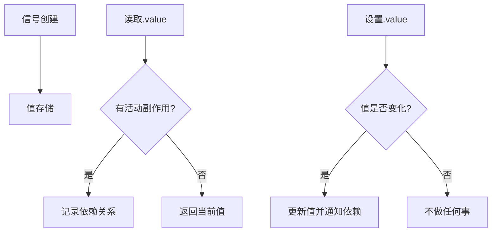

# signal

创建一个响应式信号，用于存储和跟踪值的变化。

## 基本用法

```ts
import { signal } from '@estjs/signals';

// 创建一个信号
const count = signal(0);

// 读取信号的值
console.log(count.value); // 0

// 修改信号的值
count.value = 1;

// 使用update方法更新信号的值
count.update(value => value + 1);

// 不建立依赖关系地读取值
const currentValue = count.peek();
```

## 类型定义

```ts
function signal<T>(value: T): Signal<T>;

interface Signal<T> {
  value: T;
  peek(): T;
  set(value: T): void;
  update(updater: (prev: T) => T): void;
}
```

## 参数

| 参数 | 类型 | 描述 |
|------|------|------|
| value | `T` | 信号的初始值，可以是任何类型 |

## 返回值

返回一个`Signal<T>`对象，该对象具有以下属性和方法：

- **value** - 读取或设置信号的值。读取时会建立依赖关系，设置时会通知依赖更新。
- **peek()** - 读取当前值而不建立依赖关系。
- **set(value)** - 设置信号的值，等同于`signal.value = value`。
- **update(updater)** - 使用一个函数来更新信号的值，该函数接收当前值并返回新值。

## 示例

### 基本操作

```ts
import { signal } from '@estjs/signals';

const count = signal(0);
console.log(count.value); // 0

count.value = 1;
console.log(count.value); // 1

count.update(val => val + 1);
console.log(count.value); // 2
```

### 不同数据类型

```ts
// 数字
const count = signal(0);

// 字符串
const name = signal('张三');

// 布尔值
const isActive = signal(true);

// 对象
const user = signal({ name: '李四', age: 30 });

// 数组
const items = signal([1, 2, 3]);

// 空值
const nullable = signal(null);
const undef = signal(undefined);
```

### 与其他API结合使用

```ts
import { computed, effect, signal } from '@estjs/signals';

const count = signal(0);

// 创建依赖于信号的计算属性
const doubleCount = computed(() => count.value * 2);

// 创建观察信号变化的副作用
effect(() => {
  console.log(`计数: ${count.value}, 双倍: ${doubleCount.value}`);
});

// 修改信号值时会触发副作用和更新计算属性
count.value = 1;
// 输出: 计数: 1, 双倍: 2
```

### 嵌套对象

当信号包含嵌套对象时，内部对象的属性变化会被追踪：

```ts
const user = signal({
  name: '张三',
  profile: {
    age: 30,
    address: {
      city: '北京',
    },
  },
});

effect(() => {
  console.log(`用户城市: ${user.value.profile.address.city}`);
});

// 会触发副作用
user.value.profile.address.city = '上海';
```

## 浅层信号

对于复杂的嵌套对象，如果只需要追踪顶层属性的变化，可以使用`shallowSignal`：

```ts
import { shallowSignal } from '@estjs/signals';

const user = shallowSignal({
  name: '张三',
  profile: {
    age: 30,
  },
});

effect(() => {
  console.log(`用户名: ${user.value.name}`);
});

// 会触发副作用
user.value.name = '李四';

// 不会触发副作用
user.value.profile.age = 31;
```

## 工作原理

当信号的`.value`被访问时，当前活动的副作用（如果有）会被记录为该信号的依赖。当信号的值改变时，所有记录的依赖会被通知并重新执行。



## 类型检查

您可以使用`isSignal`函数来检查一个值是否为信号：

```ts
import { isSignal, signal } from '@estjs/signals';

const count = signal(0);
const notSignal = { value: 0 };

console.log(isSignal(count)); // true
console.log(isSignal(notSignal)); // false
```

## 注意事项

1. **避免在信号中存储大型不可变数据结构**：这可能导致频繁的重新渲染和内存消耗。
2. **使用peek()避免不必要的依赖**：当您只想读取值而不建立依赖关系时。
3. **信号对对象和数组是深度响应的**：由于底层使用了 `reactive`，您可以直接修改信号内的对象，这会自动触发依赖更新。

```ts
const user = signal({ name: '张三' });

// 直接修改嵌套属性，会正常触发依赖更新
user.value.name = '李四'; 
```

4. **信号采用同步执行模型**：当值变化时，相关副作用会立即同步执行。
